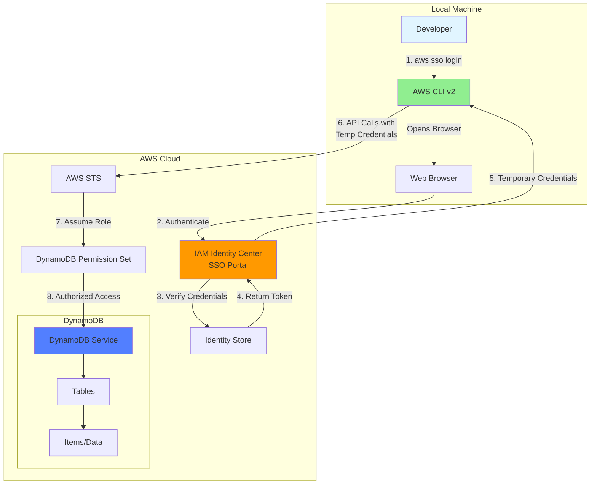
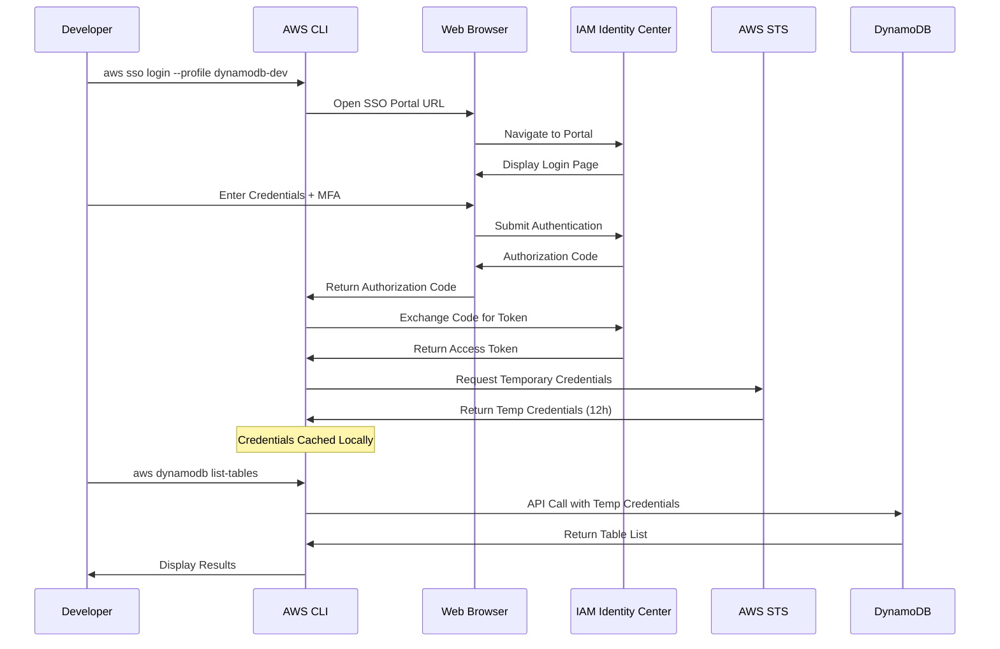
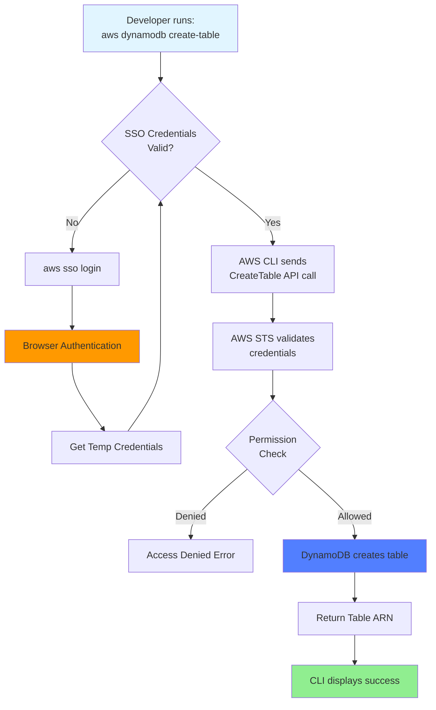
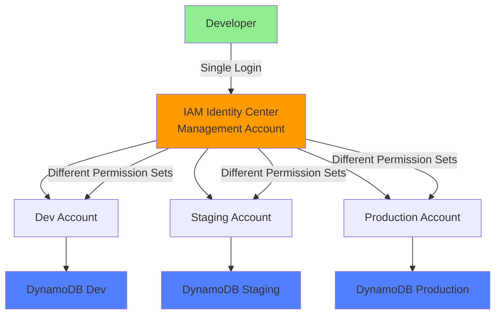

# AWS SSO + DynamoDB Architecture

## High-Level Architecture



## Authentication Flow



## Component Details

### 1. Local Machine Components

```
┌─────────────────────────────────────────┐
│         Local Machine (macOS)           │
├─────────────────────────────────────────┤
│                                         │
│  ┌──────────────────────────────────┐  │
│  │       AWS CLI v2                 │  │
│  │  - SSO Authentication            │  │
│  │  - Credential Management         │  │
│  └──────────────────────────────────┘  │
│                                         │
│  ┌──────────────────────────────────┐  │
│  │   ~/.aws/config                  │  │
│  │  [profile dynamodb-dev]          │  │
│  │  sso_session = my-sso            │  │
│  │  sso_account_id = 123456789012   │  │
│  │  sso_role_name = DynamoDBAccess  │  │
│  └──────────────────────────────────┘  │
│                                         │
│  ┌──────────────────────────────────┐  │
│  │   ~/.aws/sso/cache/              │  │
│  │  - Cached SSO tokens             │  │
│  │  - Temporary credentials         │  │
│  │  - Auto-expires after 12h        │  │
│  └──────────────────────────────────┘  │
└─────────────────────────────────────────┘
```

### 2. AWS IAM Identity Center

```
┌─────────────────────────────────────────┐
│      IAM Identity Center (SSO)          │
├─────────────────────────────────────────┤
│                                         │
│  ┌──────────────────────────────────┐  │
│  │   Identity Store                 │  │
│  │  - Users                         │  │
│  │  - Groups                        │  │
│  │  - MFA Settings                  │  │
│  └──────────────────────────────────┘  │
│                                         │
│  ┌──────────────────────────────────┐  │
│  │   Permission Sets                │  │
│  │  - DynamoDBFullAccess            │  │
│  │  - Session Duration: 12h         │  │
│  │  - IAM Policies Attached         │  │
│  └──────────────────────────────────┘  │
│                                         │
│  ┌──────────────────────────────────┐  │
│  │   Account Assignments            │  │
│  │  User → Account → Permission Set │  │
│  └──────────────────────────────────┘  │
└─────────────────────────────────────────┘
```

### 3. AWS Account & DynamoDB

```
┌─────────────────────────────────────────┐
│          AWS Account                    │
├─────────────────────────────────────────┤
│                                         │
│  ┌──────────────────────────────────┐  │
│  │   AWS STS (Security Token Svc)   │  │
│  │  - Issues Temporary Credentials  │  │
│  │  - Role Assumption               │  │
│  └──────────────────────────────────┘  │
│                                         │
│  ┌──────────────────────────────────┐  │
│  │   DynamoDB Service               │  │
│  │                                  │  │
│  │  ┌────────────────────────────┐  │  │
│  │  │  Tables                    │  │  │
│  │  │  - TestTable               │  │  │
│  │  │  - UsersTable              │  │  │
│  │  │  - ProductsTable           │  │  │
│  │  └────────────────────────────┘  │  │
│  │                                  │  │
│  │  ┌────────────────────────────┐  │  │
│  │  │  Operations                │  │  │
│  │  │  - CreateTable             │  │  │
│  │  │  - PutItem                 │  │  │
│  │  │  - GetItem                 │  │  │
│  │  │  - Query                   │  │  │
│  │  │  - Scan                    │  │  │
│  │  └────────────────────────────┘  │  │
│  └──────────────────────────────────┘  │
│                                         │
│  ┌──────────────────────────────────┐  │
│  │   CloudTrail (Audit Logs)        │  │
│  │  - All API calls logged          │  │
│  │  - Who, What, When               │  │
│  └──────────────────────────────────┘  │
└─────────────────────────────────────────┘
```

## Security Model

```mermaid
graph LR
    A[User Login] -->|MFA Optional| B[IAM Identity Center]
    B -->|Authenticate| C[Identity Store]
    C -->|Success| D[Generate Token]
    D -->|12h Session| E[Temporary Credentials]
    E -->|Assume Role| F[Permission Set]
    F -->|IAM Policy| G[DynamoDB Access]
    
    style A fill:#90EE90
    style B fill:#ff9900
    style E fill:#FFD700
    style G fill:#527FFF
```



### Security Layers

1. **Authentication Layer**
   - Username/Password
   - Optional MFA (TOTP/SMS)
   - Identity verification

2. **Authorization Layer**
   - Permission Sets (IAM Policies)
   - Least Privilege Access
   - Resource-level permissions

3. **Session Management**
   - Temporary credentials (12h default)
   - Automatic expiration
   - No long-term keys

4. **Audit Layer**
   - CloudTrail logging
   - All API calls tracked
   - Compliance reporting

## Data Flow: Creating a DynamoDB Table



## Credential Lifecycle

```
┌─────────────────────────────────────────────────────────┐
│                  Credential Lifecycle                   │
└─────────────────────────────────────────────────────────┘

Time: 0h                    6h                    12h
│                           │                     │
├───────────────────────────┼─────────────────────┤
│   Credentials Valid       │  Still Valid        │ Expired
│                           │                     │
│   ✓ API calls work        │  ✓ API calls work   │ ✗ Need re-login
│   ✓ No re-auth needed     │  ✓ No re-auth       │ ✗ aws sso login
│                           │                     │
└───────────────────────────┴─────────────────────┘

After expiration:
1. Run: aws sso login --profile dynamodb-dev
2. Browser opens for re-authentication
3. New 12h session begins
```

## Comparison: Traditional vs SSO Authentication

### Traditional IAM User (Not Recommended)

```
┌──────────────┐
│  Developer   │
└──────┬───────┘
       │
       │ Long-term Access Keys
       │ (Never expire)
       │
       ▼
┌──────────────┐
│  AWS Account │
│              │
│  ┌────────┐  │
│  │DynamoDB│  │
│  └────────┘  │
└──────────────┘

❌ Security Risks:
- Keys never expire
- If leaked, permanent access
- Hard to rotate
- No MFA enforcement
```

### SSO with IAM Identity Center (Recommended)

```
┌──────────────┐
│  Developer   │
└──────┬───────┘
       │
       │ Browser-based login
       │ + Optional MFA
       │
       ▼
┌──────────────┐
│ IAM Identity │
│   Center     │
└──────┬───────┘
       │
       │ Temporary Credentials
       │ (12h expiration)
       │
       ▼
┌──────────────┐
│  AWS Account │
│              │
│  ┌────────┐  │
│  │DynamoDB│  │
│  └────────┘  │
└──────────────┘

✅ Security Benefits:
- Credentials auto-expire
- MFA support
- Centralized management
- Audit trail
- Easy to revoke
```

## Network Flow

```
Internet
   │
   │ HTTPS (443)
   │
   ▼
┌─────────────────────────┐
│  AWS Edge Locations     │
│  (CloudFront)           │
└────────┬────────────────┘
         │
         │ TLS 1.2+
         │
         ▼
┌─────────────────────────┐
│  IAM Identity Center    │
│  Regional Endpoint      │
│  (us-east-1)            │
└────────┬────────────────┘
         │
         │ Internal AWS Network
         │
         ▼
┌─────────────────────────┐
│  DynamoDB Service       │
│  Regional Endpoint      │
│  (us-east-1)            │
└─────────────────────────┘
```

## Permission Set Structure

```yaml
Permission Set: DynamoDBFullAccess
├── Name: DynamoDBFullAccess
├── Description: Full access to DynamoDB
├── Session Duration: 12 hours
├── Relay State: (optional)
└── Managed Policies:
    └── AmazonDynamoDBFullAccess
        ├── dynamodb:*
        ├── dax:*
        ├── application-autoscaling:*
        ├── cloudwatch:*
        ├── iam:GetRole
        ├── iam:ListRoles
        └── sns:*
```

## Multi-Account Architecture (Future)



## Summary

This architecture provides:

✅ **Secure Authentication**: Browser-based SSO with optional MFA  
✅ **Temporary Credentials**: Auto-expiring credentials (12h)  
✅ **Centralized Management**: Single place to manage users and permissions  
✅ **Audit Trail**: All actions logged in CloudTrail  
✅ **Scalable**: Easy to add accounts, users, and permissions  
✅ **Cost-Effective**: No additional charges for IAM Identity Center  

The architecture follows AWS best practices and provides a secure, scalable foundation for accessing DynamoDB and other AWS services.
